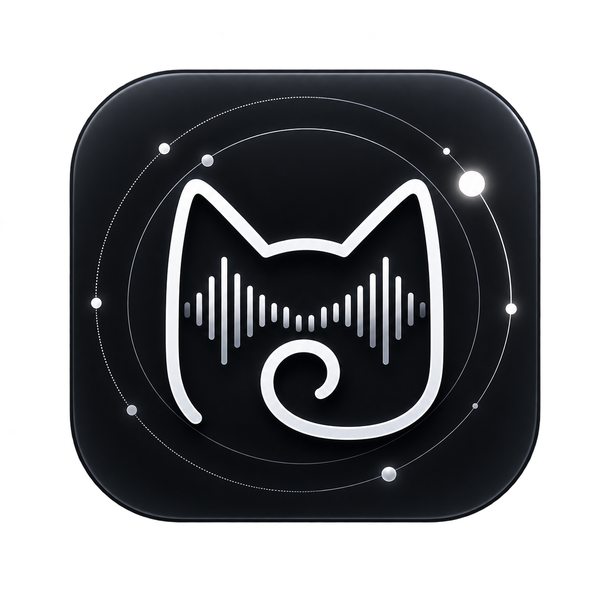

# Meow · 觅乐

### 一个为 HarmonyOS 打造的音乐播放器

基于 HarmonyOS 7 / API 26 开发  
支持 Navidrome、本地音乐与 WebDAV

 

 

**🚧 Under Development · 正在开发中**

---

## 🎵 关于 Meow

**Meow · 觅乐** 是一个个人兴趣驱动的 HarmonyOS 音乐播放器项目。

项目希望在提供简洁音乐播放体验的同时，尽可能利用 HarmonyOS 的系统能力，并支持连接个人音乐库。

目前项目仍处于持续开发、功能调整和界面完善阶段，部分功能和设计可能在后续版本中发生变化。

---

## ✨ 功能

目前已经实现、正在开发或计划支持的功能包括：

- 🎧 音乐播放
- 📃 播放队列
- 🔀 顺序 / 单曲循环 / 列表循环 / 随机播放
- 💿 专辑浏览
- 🎤 艺术家页面
- 📂 歌单浏览
- 🔎 音乐搜索
- 💡 搜索联想与历史记录
- 🎵 相似歌曲发现
- 📡 Navidrome 音乐服务器
- 📁 本地音乐
- ☁️ WebDAV
- ⬇️ 音乐下载
- 🌙 深色模式
- 📱 HarmonyOS 系统媒体控制
- 🔔 通知栏媒体控制
- 🎶 系统媒体卡片适配
- 🖼️ 专辑封面与播放界面
- ⭐ 艺术家关注与内容推荐
- ⏱️ 定时停止播放
- 🎨 HarmonyOS 风格界面与交互

> [!NOTE]
> 项目仍处于开发阶段，上述功能的实现状态和最终设计可能随版本调整。

---

## 📱 Preview

应用界面目前仍在持续调整中。

截图将在界面和主要功能进一步稳定后补充。

---

## 📡 音乐来源

Meow 计划支持多种音乐来源。

### Navidrome

连接自建的 Navidrome 音乐服务器，浏览和播放个人音乐库。

### Local Music

扫描并播放设备中的本地音乐。

### WebDAV

通过 WebDAV 访问个人存储中的音乐文件。

### 第三方音源

接入网易云/QQ音乐等平台由于没有官方渠道，不能保证登录的账号是否会受到封禁，故未做该功能

---

## 🧩 HarmonyOS

Meow 项目正在尽可能探索和使用 HarmonyOS 提供的系统能力，例如：

- 系统媒体会话
- 通知栏播放控制
- 系统媒体卡片
- 深色模式
- 系统导航与转场
- HarmonyOS 原生交互体验
- 系统级播放状态同步

项目目前主要面向：

**HarmonyOS 7 / API 26**

---

## 🚧 开发状态

当前状态：

### `Active Development`

项目目前仍存在较多：

- 功能开发
- UI 调整
- 播放逻辑优化
- 系统能力适配
- 代码整理与重构

因此，目前暂未上传完整源码。

待项目的主要结构和核心功能进一步稳定后，将逐步整理并公开相关源码。

---

## 📦 Source Code

**完整源码暂未公开。**

目前 GitHub 仓库主要用于：

- 项目主页
- 开发状态展示
- 项目说明
- 后续版本记录
- 源码发布准备

源码将在项目达到相对稳定状态后逐步上传。

---

## 🛠️ Maintenance

这是一个以个人使用、学习、兴趣和探索为主要目的的开源项目。

项目采用 **Best-effort Maintenance（尽力而为 / 随缘维护）** 的维护方式。

欢迎：

- 提交 Issue
- 提出功能建议
- 提交 Pull Request
- Fork 项目并进行自己的开发

但请注意：

- 不保证所有 Issue 都会得到回复
- 不保证所有 Bug 都会及时修复
- 不保证所有功能请求都会实现
- 不提供固定的版本更新周期
- 不提供长期技术支持承诺

维护优先级主要取决于个人时间、兴趣和实际使用需求。

如果某项功能对你很重要，也欢迎在源码公开后 Fork 项目并自行实现。

---

## 🤖 关于开发方式

本项目包含 AI 辅助开发内容。

AI 主要用于协助：

- 代码编写
- 问题排查
- 重构
- UI 实现
- 文档整理

项目的功能设计、交互方向、实际测试、整合与最终决策由项目维护者完成。

使用 AI 辅助开发并不代表相关第三方项目、平台或 AI 服务对本项目提供官方支持或背书。

---

## 🤝 Contribution

源码公开后，欢迎参与项目开发。

你可以通过以下方式参与：

- 提交 Bug 报告
- 提出改进建议
- 完善文档
- 修复已有问题
- 开发新的功能
- 提交 Pull Request

由于这是个人项目，Pull Request 可能不会立即得到处理，也不保证所有提交都会被合并。

---

## 🔀 Fork

欢迎 Fork Meow 并按照自己的需求继续开发。

后续具体的代码使用、修改、再分发和署名要求，将以项目正式发布的 **LICENSE** 为准。

---

## 📄 License

**许可证尚未最终确定。**

由于项目仍在开发和源码整理阶段，在正式公开完整源码之前，还会进一步检查：

- 项目自身代码
- HarmonyOS / Huawei 官方示例代码
- 第三方代码或资源
- 相关依赖许可证
- 署名与再分发要求

最终许可证将在源码正式公开前补充。

在 LICENSE 正式加入仓库之前，请不要将当前仓库内容视为已经授予任意开源许可证。

---

## ⚠️ Disclaimer

Meow 是一个非官方个人项目。

本项目与 Huawei、HarmonyOS、Navidrome、WebDAV 服务提供方以及其他相关项目不存在官方隶属或合作关系。

项目中出现的相关名称和商标归各自权利人所有。

---

## 🗺️ Roadmap

目前没有固定的版本发布日期。

大致开发方向包括：

- [ ] 完善核心播放体验
- [ ] 完善 Navidrome 支持
- [ ] 完善本地音乐支持
- [ ] 完善 WebDAV 支持
- [ ] 完善搜索与音乐发现
- [ ] 完善 HarmonyOS 系统媒体能力
- [ ] 优化深色模式
- [ ] 优化动画与页面转场
- [ ] 完善下载与离线播放
- [ ] 整理项目结构
- [ ] 整理第三方代码来源
- [ ] 确定开源许可证
- [ ] 公开源码
- [ ] 发布首个可用版本

Roadmap 仅代表当前计划，可能随开发情况调整。

---

## ⭐ Star

如果你对这个项目感兴趣，可以给它一个 **Star ⭐**。

---

 

### Meow · 觅乐

**Find your happy.**

A personal HarmonyOS music player project.

 

Made with ♪ for HarmonyOS

